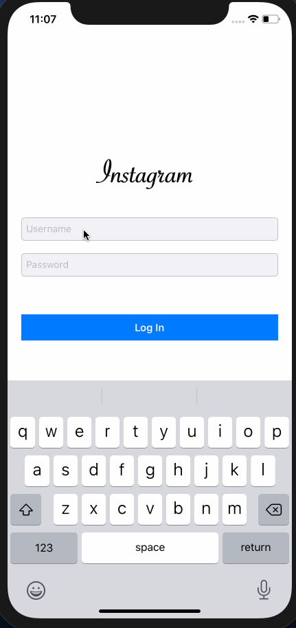
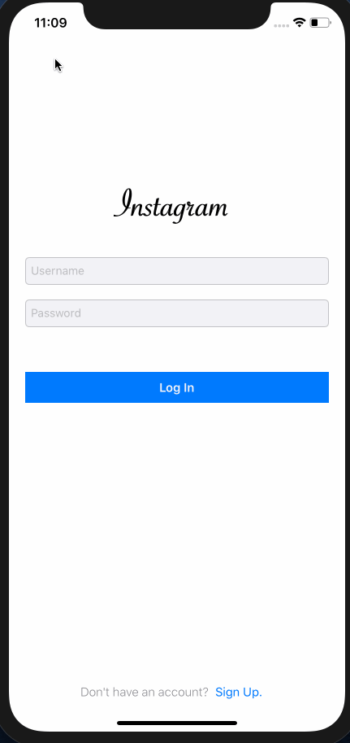
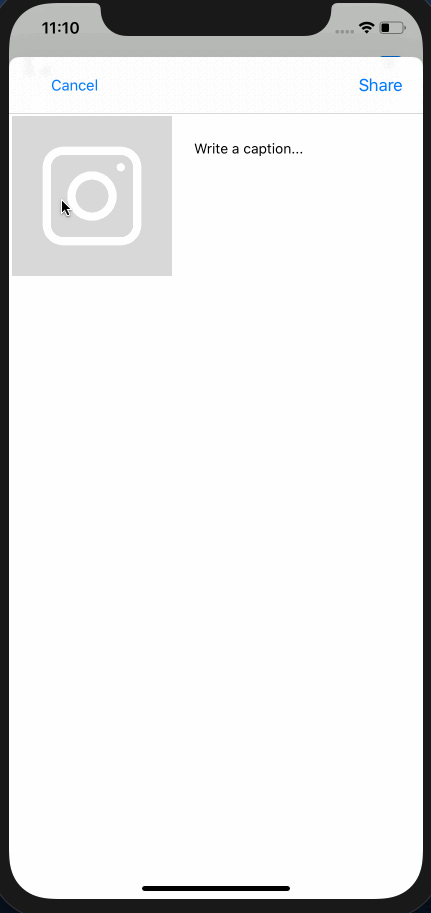
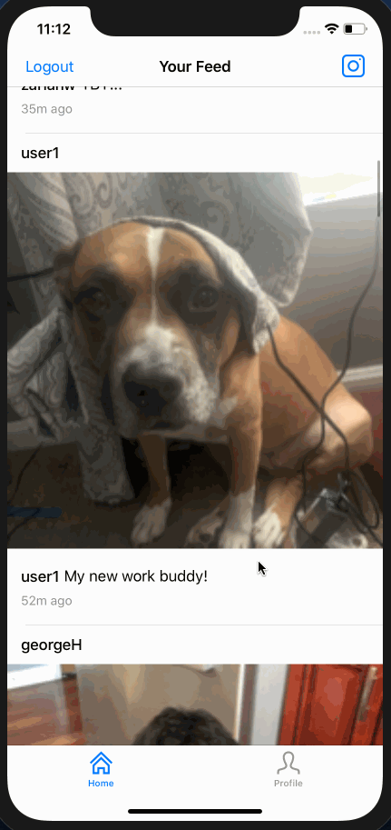

# Project 4 - brInstagram

brInstagram is a photo sharing app using Parse as its backend.

Time spent: 23 hours spent in total

## User Stories

The following **required** functionality is completed:

- [x] User can sign up to create a new account using Parse authentication
- [x] User can log in and log out of his or her account
- [x] The current signed in user is persisted across app restarts
- [x] User can take a photo, add a caption, and post it to "Instagram"
- [x] User can view the last 20 posts submitted to "Instagram"
- [x] User can pull to refresh the last 20 posts submitted to "Instagram"
- [x] User can tap a post to view post details, including timestamp and caption.

The following **optional** features are implemented:

- [ ] Run your app on your phone and use the camera to take the photo
- [x] Style the login page to look like the real Instagram login page.
- [ ] Style the feed to look like the real Instagram feed.
- [x] User can use a tab bar to switch between all "Instagram" posts and posts published only by the user. AKA, tabs for Home Feed and Profile
- [x] User can load more posts once he or she reaches the bottom of the feed using infinite scrolling.
- [x] Show the username and creation time for each post
- [x] After the user submits a new post, show a progress HUD while the post is being uploaded to Parse
- User Profiles:
  - [ ] Allow the logged in user to add a profile photo
  - [ ] Display the profile photo with each post
  - [ ] Tapping on a post's username or profile photo goes to that user's profile page
- [ ] User can comment on a post and see all comments for each post in the post details screen.
- [ ] User can like a post and see number of likes for each post in the post details screen.
- [ ] Implement a custom camera view.

The following **additional** features are implemented:

- [x] User can see their username at the top of the profile page.

Please list two areas of the assignment you'd like to **discuss further with your peers** during the next class (examples include better ways to implement something, how to extend your app in certain ways, etc):

1. The best way to implement the comment sections. Should it just be another column in the Posts table.
2. How would one implement a following system. What is the best way to implement a many to many relationship.

## Video Walkthrough

Here's a walkthrough of implemented user stories:

- User can sign up to create a new account using Parse authentication
- Style the login page to look like the real Instagram login page.

- User can log in and log out of his or her account
- The current signed in user is persisted across app restarts

- User can view the last 20 posts submitted to "Instagram"
- User can load more posts once he or she reaches the bottom of the feed using infinite scrolling.

- User can pull to refresh the last 20 posts submitted to "Instagram"
- User can take a photo, add a caption, and post it to "Instagram"
- After the user submits a new post, show a progress HUD while the post is being uploaded to Parse

- User can tap a post to view post details, including timestamp and caption.
- Show the username and creation time for each post
- User can use a tab bar to switch between all "Instagram" posts and posts published only by the user. AKA, tabs for Home Feed and Profile
- User can see their username at the top of the profile page.

GIFs created with [LiceCap](http://www.cockos.com/licecap/).

## Credits

List an 3rd party libraries, icons, graphics, or other assets you used in your app.

- [AFNetworking](https://github.com/AFNetworking/AFNetworking) - networking task library
- [DateTools](https://github.com/MatthewYork/DateTools) - streamline date and time handling in iOS
- [MBProgressHUD](https://cocoapods.org/pods/MBProgressHUD) - displays a translucent HUD with an indicator and/or labels 
- [Parse] (https://cocoapods.org/pods/Parse) - gives you access to the powerful Parse Server backend

## Notes

- Getting AutoLayout to work with the Scroll View.
- @import Parse would not work, so I had to simply #import the specific file that I needed.
- Duplicate symbols for architecture x86_64 under Xcode: I was importing an implementation file rather than the header file for a class.

## License

    Copyright [2020] [Briana Mason]

    Licensed under the Apache License, Version 2.0 (the "License");
    you may not use this file except in compliance with the License.
    You may obtain a copy of the License at

        http://www.apache.org/licenses/LICENSE-2.0

    Unless required by applicable law or agreed to in writing, software
    distributed under the License is distributed on an "AS IS" BASIS,
    WITHOUT WARRANTIES OR CONDITIONS OF ANY KIND, either express or implied.
    See the License for the specific language governing permissions and
    limitations under the License.
